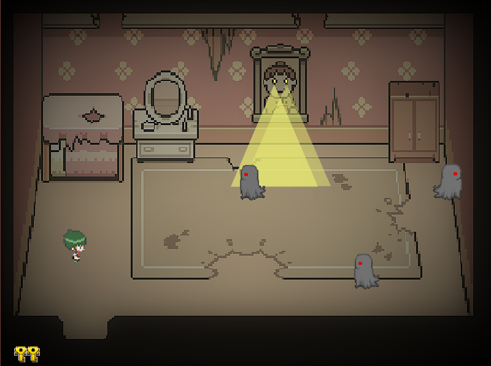
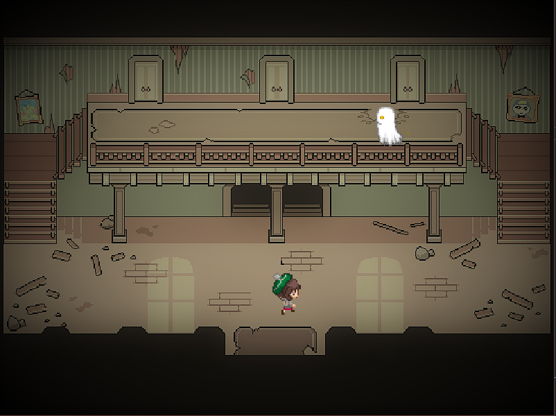

# Spectral Escape

- **Main concept**
You are a brave sibling who ventures into a haunted mansion to rescue your
sibling kidnapped by ghosts. You must sneak around, search for keys and avoid
being seen by the ghosts to succeed in your mission.
- **Key features**
 - Strategic and stealth approach.
 - Exciting and tense dynamics as you avoid the ghosts.
 - Explore the rooms of the mansion to find clues and key objects.
- **Genre**
Stealth and adventure game.
- **Gameplay**
The player must rescue his kidnapped brother, avoiding being seen by ghosts.
He must move stealthily, find keys to open doors and search for clues to advance
the story. 

## Screenshots

## Installation

1. Clone the repository:

        git clone https://github.com/danipel/SpectralEscape.git

2. Install the dependencies:

        pip install pygame

This proyect was made using pygame.

### About Pygame

Pygame is a popular open-source library for developing 2D games in Python. It provides functionality for handling graphics, sound, input, and more, making it an excellent choice for game development projects. With Pygame, developers can bring their game ideas to life quickly and efficiently.

## Game Controls

Movement: W, A, S ,D .

Interact: C .

## Credits

- Sounds
  - http://vinraxarts.ru/
  - https://opengameart.org/users/youre-perfect-studio
- Images
  - http://www.kelvinshadewing.net/
  - https://www.deviantart.com/tebited15/art/Spooky-s-Haunted-Mansion-348430437
  - https://www.deviantart.com/zender1752
  - https://www.deviantart.com/liberataryan/art/secret-place-711988325
  - https://forums.rpgmakerweb.com/index.php?members/whtdragon.8636/

## Contact

Email:
d.pelaez@utp.edu.co
